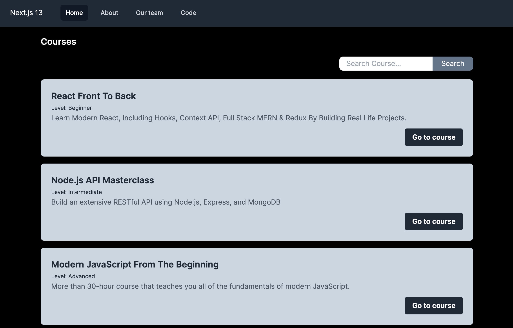

# Next.js 13 project

It uses the newer features such as:

- App directory
- New routing system
- Next Fonts
- React Server Components
- Data Fetching
- Layouts
- Metadata API
- API Route Handlers
- loading.js Page
- and more



## Getting Started

Install dependencies:

```bash
npm install
# or
yarn
```

First, run the development server:

```bash
npm run dev
# or
yarn dev
# or
pnpm dev
```

Open [http://localhost:3000](http://localhost:3000) with your browser to see the result.

This project uses [`next/font`](https://nextjs.org/docs/basic-features/font-optimization) to automatically optimize and load Inter, a custom Google Font.

Build the project:

```bash
npm run build
# or
yarn build
```

Run production build:

```bash
npm run start
# or
yarn start
```
